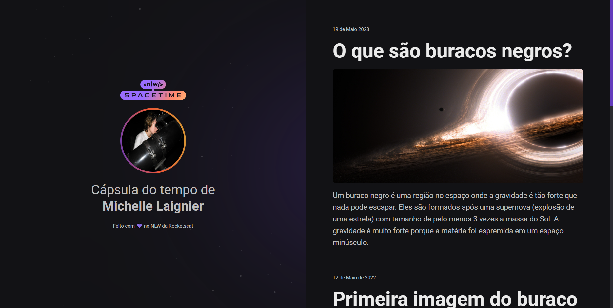

# Spacetime

Projeto de cápsula do tempo feito para exibir memórias em uma linha do tempo.  
Desenvolvido durante o Next Level Week da Rocketseat.

## Tecnologias

- CSS  
- HTML  
- Git  

  

## Layout

Você pode visualizar o layout do projeto através [desse link](<https://www.figma.com/file/G1wrFk2PttT0yxd0M5Y0OM/Cápsula-do-tempo-•-Trilha-Explorer-(Community)?type=design&node-id=306-3&t=BEUMgit932M96gvW-0>).  
É necessário ter uma conta no [Figma](https://www.figma.com).
